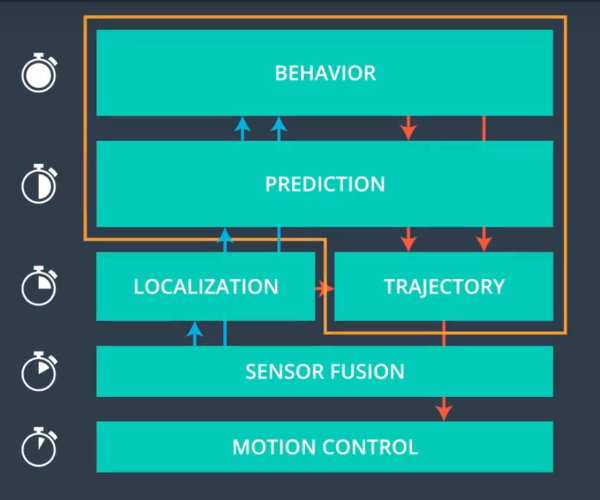

# Self-driving-car Term 2 Highway Driving

# Overview

The goal of this project is to build a path planner that creates smooth, safe trajectory for cars on highway driving.
The code creates a successful path planner which is able to 

- keep inside its lane
- avoid hitting other cars
- pass slower moving traffic all by localization, sensor fusion, and map data.

# Completion Process

The project has been built based on materials of the lesssons. The picture clearly reflects the process of path planner generation.

On the picture above ,  the inputs to behavior planning come from prediction model and localization model, both of which gets their inputs from the sensor fusion. 
And the output from the behavior model goes directly into the trajectory planner, which also takes input from prediction and localization. 
So that it can send trajectory to the motion controller.

## Prediction 

Predictions come from the sensor fusion data [id, x, y, vx, vy, s, d]. 
The id is a unique identifier. The x, y values are in global map coordinates, and the vx, vy values are the velocity components, also in reference to the global map.
Finally s and d are the Frenet coordinates for the car. 

According to this  information, we can undertsand  whether
 
- there is car blocking the traffic ahead of ego car 
- whether there is a car to the right of the ego car 
- whether there is a car to the left of ego car 

It is considered "dangerous" if the distance between ego car and other cars is less than 30 meters in front or behind of ego car. 
The Boolean variables  of  ***too_close***, ***car_left*** and ***car_right***  are used to make correct behaviors.(line 118 to line 158 in main.cpp)
It is implemented at [Highway Driving::correct_behaviours](./src/main.cpp#L116)

## Behavior

According to the prediction results,  the ego car can make correct decisions. 

- if ***too_close*** is true which indicates there is a car blocking in front of ego car, the ego car will plan to change lane. 
- if  ***car_left*** and ***car_right*** are both false, it is not safety to change lane,and the ego car will decelerate 0.224 mph every point at current velocity in its own lane until the sensor fusion tells the environment around the ego car is safety. (line 160 to line189 in main.cpp).

## Trajectory

The code builds a 50 points path, every time the ego car starts a new path with whatever previous path points were left over from last time, then append new waypoints until the new path has 50 total waypoints. 
The method can make a smoother trajectory, and handle with the different frequencies of prediction model, behavior model and trajectory model.

Spline fitting is used to generate trajectory from Project Q&A of Aaron Brown. 
For making calculation easy, it is necessary to shift the car or the last point of previous path is at zero, and its angle is at zero degree.
In the local car coordinate, the code calculates how to break up spline points so that the ego car can travel at a desired velocity (this has been taken from Q&A) 
After finishing spline fitting, it must be rotated back to map coordinate.(line 191 to line 296 in main.cpp)  
[Highway Driving::mapback](./src/main.cpp#L197)

# Visualization of Result

   

# Running the Program

1. Download the simulator and open it. In the main menu screen select : Path Planning.
2. Instructions on simulator set up are locater here ./SIMULATOR.mb
